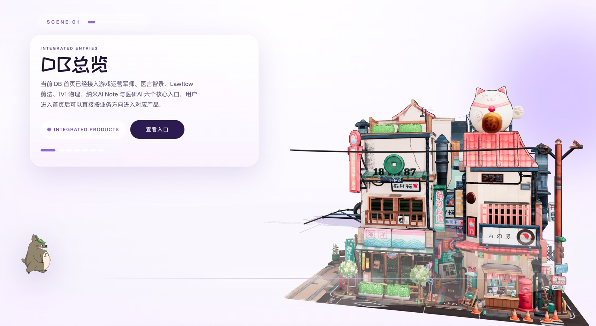

  

<h1 align="center">多边 · DB</h1>

  <strong>EXPLORE · DISCOVER · TRY</strong> 
  沉浸式视觉叙事的 AI 产品矩阵入口

  
  &nbsp;
  

  
  

 

---

## ✨ 产品简介

**DB · 多边** 是一个以沉浸式视觉叙事为载体的 AI 产品矩阵平台，将多款垂直领域的 AI 工具整合于同一个入口之下。页面以动态场景漫游的方式引导用户探索，极具设计感。

平台目前覆盖**六大核心产品方向**：

- 🩺 **医言智录** — 用 AI 自动生成合规医疗文书，让医生从繁琐记录中解放
- ⚖️ **Lawflow 剪法** — 将 AI 能力引入法律工作流
- 📐 **1V1 物理** — 精准定位学生的思维阻滞点，重塑个性化学习体验
- 📝 **纳米 AI Note** — Agentic AI 硬件终端，集听、记、思、写于一体，成为职场人的超级私人助理
- 🧬 **医研 AI** — 面向医学研究场景提供智能支持
- 🎮 **游戏运营军师** — 帮助游戏团队将碎片化运营需求即时转化为结构化策略，抢回关键决策窗口

DB 不只是产品目录，它更像一条街道——**每一扇门，都通往一个正在被 AI 重塑的行业现场**。

 

## 🎬 产品截图

  
   
  <b>沉浸式视觉叙事的 AI 产品矩阵入口</b>

 

## 🪐 立即体验

**🌐 官网体验：[db.ryanssuit.com](https://db.ryanssuit.com/)**

无需安装 · 网页直达

 

## 🛸 关于 Innate Labs

> **Building AI-native products & agents for the next generation of founders.**

[Innate Labs](https://github.com/Innate-Labs) 致力于打造下一代 AI 原生产品与智能体（Agents）。

- 🌐 GitHub：<https://github.com/Innate-Labs>
- 🪐 产品官网：<https://db.ryanssuit.com/>

 

---

  
    © 2026 <a href="https://github.com/Innate-Labs"><b>Innate Labs</b></a> &nbsp;·&nbsp;
    Crafted with 🌊 and ✨ AI &nbsp;·&nbsp;
    <a href="https://db.ryanssuit.com/">db.ryanssuit.com</a>
  

